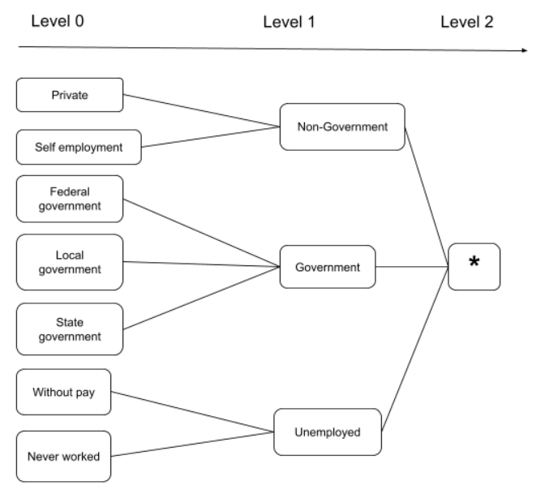
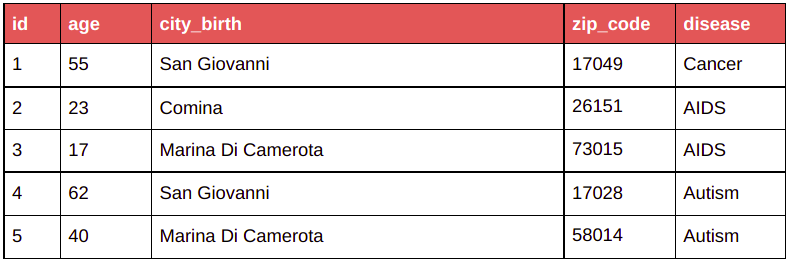
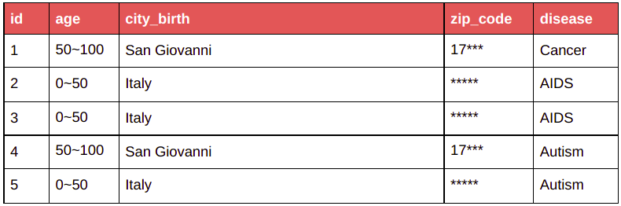
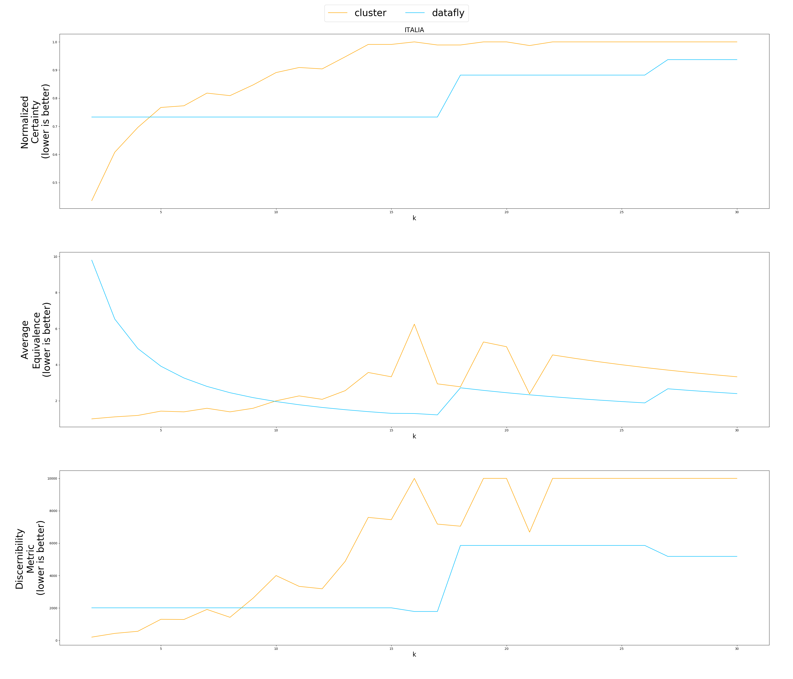
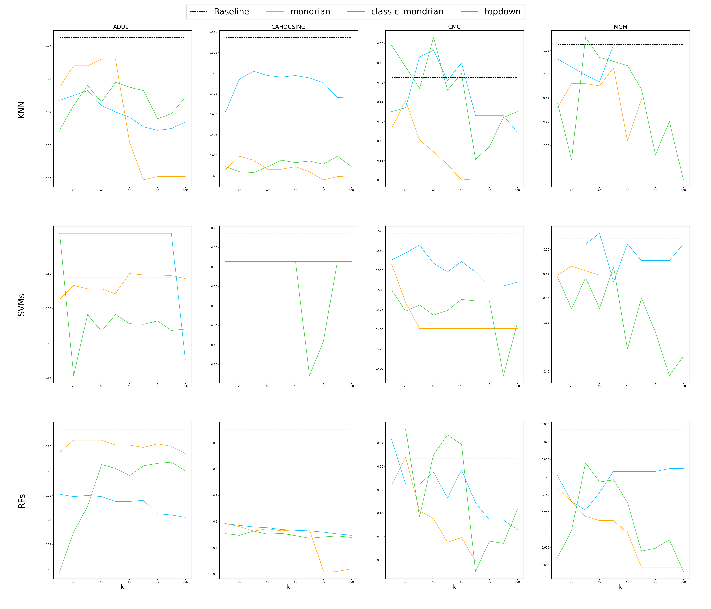
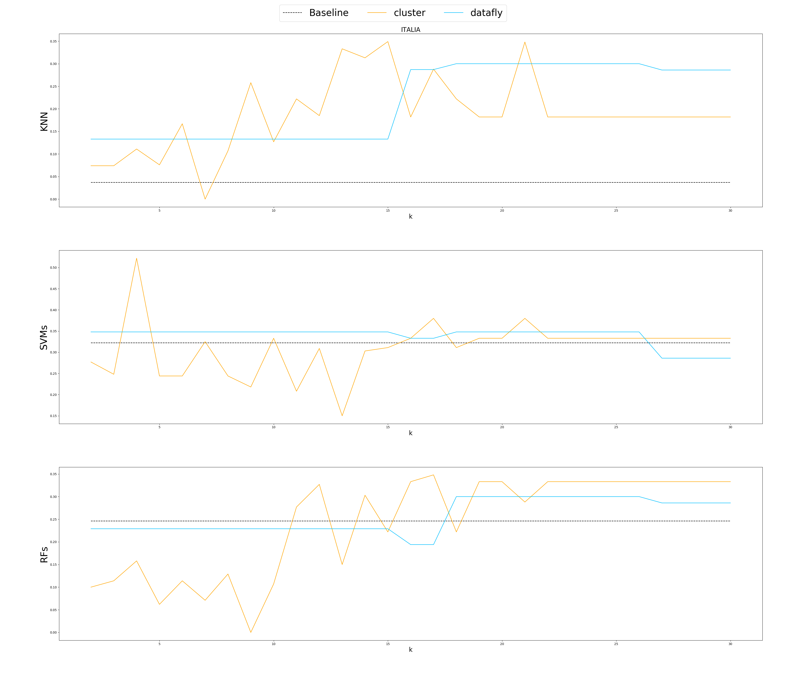

# Data anonymization using k-Anonymity
## ✔️ Experiments
- Provides 5 k-anonymization method: 
  - Datafly
  - Incognito 
  - Topdown Greedy
  - Classic Mondrian
  - Basic Mondrian
- Implements 3 anonymization metrics: 
  - Equivalent Class size metric (CAVG)
  - Discernibility Metric (DM)
  - Normalized Certainty Penalty (NCP)
- Implements 3 classification models: 
  - Random Forests 
  - Support Vector Machines 
  - K-Nearest Neighbors


## 📖 Reports
- Report edit link: [link](./demo/report.pdf)
- Slide link: [link](./demo/slides.pdf)

## Folder Structure
- A dataset must comes with a .csv file contains features information and a hierarchy folder which contains predefined generalization hierarchies for its QID attributes. 
```
this repo
│   anonymize.py
|
└───data  
│   │
│   └───adult
│       │   adult.csv
│       └───hierarchies
│       │     adult_hierarchy_workclass.csv
│       │     ....
```

- Here is an example for a generalization hierarchy of the 'workclass' attribute from ADULT dataset, described in ```adult_hierarchy_workclass.csv```, which is a csv file using **";" as delimiter**
```
Private;Non-Government;*
Self-emp-not-inc;Non-Government;*
Self-emp-inc;Non-Government;*
Federal-gov;Government;*
Local-gov;Government;*
State-gov;Government;*
Without-pay;Unemployed;*
Never-worked;Unemployed;*
```

which describes this tree:

<div align="center"></div>

-------------------------------------------------------------

## 🌟 Executing
To anonymize dataset, run:
```
python anonymize.py --method=<model_type> --k=<k-anonymity> --dataset=<dataset_name>
```
- **model_type**: [mondrian | classic_mondrian | mondrian_ldiv | topdown | cluster | datafly]
- **dataset_name**: [adult | cahousing | cmc | mgm | informs | italia]

Results will be in ```results/{dataset}/{method}``` folder

To run evaluation metrics on every combination of algorithms, datasets and value k, run:
```
python visualize.py
```

Results will be in ```demo/{metrics.png, metrics_ml.png}``` 

## K-Anonymity examples

| Before anonymization | After anonymization with k = 2 |
|:-------------------------:|:-------------------------:|
| |  |

## Evaluation Metrics
  
| Evaluate anonymization using information loss metrics |
|:-------------------------:|
| |
| |
  

| Evaluate anonymization using classification models |
|:-------------------------:|
| |
| |


## References:
- Basic Mondrian, Top-Down Greedy, Cluster-based (https://github.com/fhstp/k-AnonML)
- L-Diversity (https://github.com/Nuclearstar/K-Anonymity, https://github.com/qiyuangong/Mondrian_L_Diversity)
- Classic Mondrian (https://github.com/qiyuangong/Mondrian)
- Datafly Algorithm (https://github.com/nazilkbahar/python-datafly)
- Normalized Certainty Penalty from [Utility-Based Anonymization for Privacy Preservation with
Less Information Loss](https://citeseerx.ist.psu.edu/viewdoc/download?doi=10.1.1.450.6140&rep=rep1&type=pdf)
- Discernibility, Average Equivalent Class Size from [A Systematic Comparison and Evaluation
of k-Anonymization Algorithms
for Practitioners](http://www.tdp.cat/issues11/tdp.a169a14.pdf)
- [Privacy in a Mobile-Social World](https://courses.cs.duke.edu//fall12/compsci590.3/slides/lec3.pdf)
- Code and idea based on [k-Anonymity in Practice: How Generalisation and Suppression Affect Machine Learning Classifiers](https://arxiv.org/abs/2102.04763)
